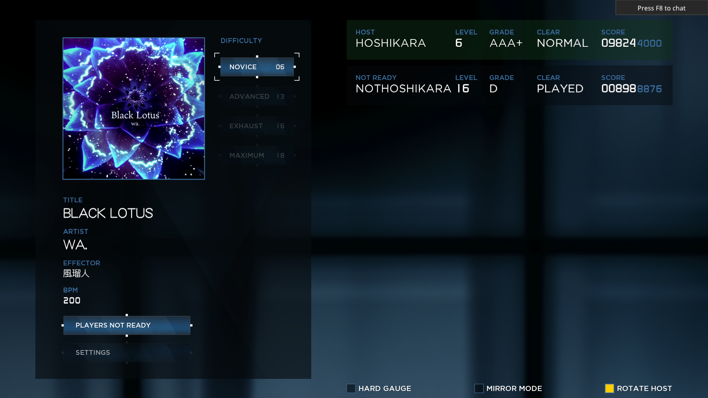

# Nightfall

A custom landscape skin for [Unnamed SDVX Clone (USC)](https://github.com/Drewol/unnamed-sdvx-clone).

## Preview Images

## Installation Guide
### Prerequisites
Please make sure your game is up-to-date by either:
  * Downloading the latest build of USC
  * Running `updater.exe` within your USC directory

### Installation
1. Download this repository as a `.zip` file
2. Extract the folder to `<USC Directory>/skins`
3. In USC, navigate to and select the skin from either:
    * `Settings > Display > Selected Skin`
    * `Settings > Skin Settings > Selected Skin`